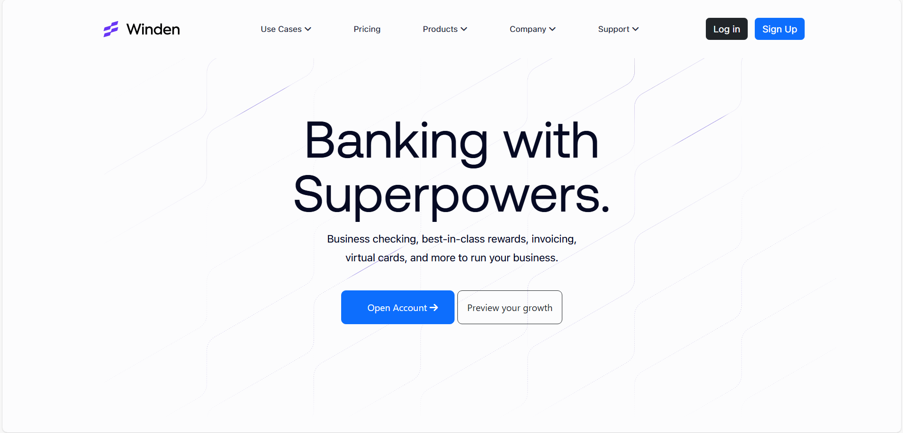
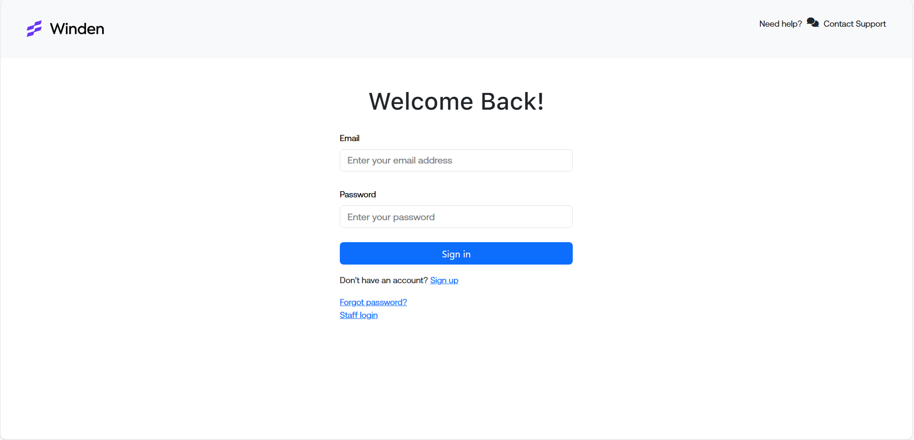
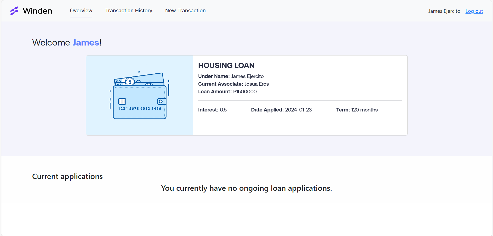
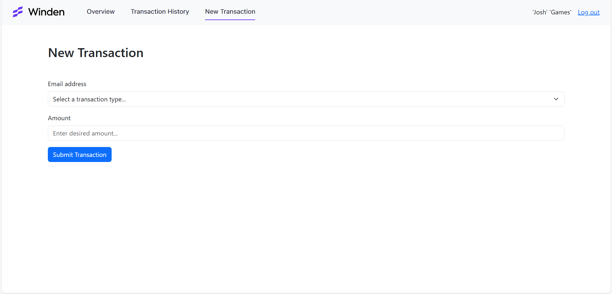
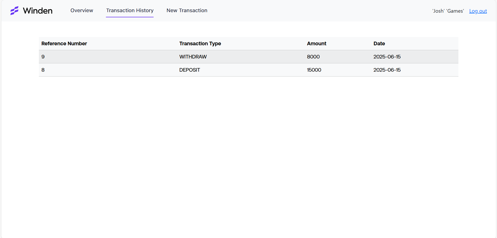

# Winden: Business Banking for Entrepreneurs

Winden is a web-based banking application designed for entrepreneurs and business owners. It provides features such as user registration, login, staff login, transaction management, loan applications, and a user dashboard.

---

## Table of Contents

- [Features](#features)
- [Project Structure](#project-structure)
- [Setup and Installation](#setup-and-installation)
- [Database Setup](#database-setup)
- [Usage](#usage)
- [Screenshots](#screenshots)
- [File Overview](#file-overview)
- [Credits](#credits)
- [License](#license)

---

## Features

- User registration and login
- Staff login
- Dashboard with loan overview and transaction history
- New transaction submission (deposit/withdraw)
- Dynamic signup form with AJAX
- Responsive design using Bootstrap 5
- FontAwesome icons

---

## Project Structure

```
.
├── backend/
│   ├── form-submit.php
│   ├── logout.php
│   ├── signup-content.php
│   └── submittransaction.php
├── img/
│   ├── credits.txt
│   ├── landingbg-start.webp
│   ├── loans.gif
│   ├── logosvg.svg
│   └── logotitle.svg
├── js/
│   └── dynamic-signup.js
├── styles/
│   ├── dashboardstyles.css
│   ├── indexstyles.css
│   ├── loginstyles.css
│   └── signupstyles.css
├── template/
│   ├── billing.php
│   ├── newtransaction.php
│   ├── overview.html
│   └── overview.php
├── dashboard.php
├── index.php
├── stafflogin.php
├── user-signup.php
└── userlogin.php
```

---

## Setup and Installation

1. **Clone or Download the Repository**

2. **Place the Project in Your Web Server Directory**
   - For XAMPP: Place the folder in `C:\xampp\htdocs\`

3. **Install Dependencies**
   - No backend dependencies required (uses PHP and MySQL).
   - Frontend dependencies (Bootstrap, jQuery, FontAwesome) are loaded via CDN.

4. **Configure Database Connection**
   - Update the database credentials in all PHP files that connect to the database (default: `root`/`malayko1`).

---

## Database Setup

1. **Create the Database**
   - Name: `127_digital_bank`

2. **Create the Required Tables**
   - You need to create tables such as `useraccount`, `customer`, `loan`, `loan_status`, `employee`, `loan_categories`, `transactions`, and `transaction_types`.
   - Make sure to set up the appropriate relationships (foreign keys).

3. **Sample Table Structure**
   - See the SQL schema or migration files (not included here).

---

## Usage

- **Homepage:** Visit `index.php` for the landing page.
- **User Registration:** Go to `user-signup.php` to create a new account.
- **User Login:** Go to `userlogin.php` to log in as a user.
- **Staff Login:** Go to `stafflogin.php` to log in as staff.
- **Dashboard:** After login, users are redirected to `dashboard.php` to view loans, transactions, and submit new transactions.

---

## Screenshots

### Landing Page


### Login Page


### Dashboard


### New Transaction


### Transaction History


---

## File Overview

- **index.php**: Landing page with navigation and marketing content.
- **user-signup.php**: User registration page with dynamic AJAX form.
- **userlogin.php**: User login page.
- **stafflogin.php**: Staff login page.
- **dashboard.php**: Main user dashboard (requires login).
- **backend/**: Contains PHP scripts for form handling, authentication, signup, logout, and transaction submission.
- **js/dynamic-signup.js**: Handles dynamic signup form logic and AJAX requests.
- **styles/**: CSS files for different parts of the application.
- **template/**: Contains PHP and HTML templates for dashboard sections (overview, billing, new transaction).
- **img/**: Images and assets used in the UI.

---

## Credits

- UI inspired by [Winden Business Banking](https://www.winden.co/)
- Some images from [Dribbble](https://dribbble.com/shots/3610657-Wallet) (`img/credits.txt`)
- Bootstrap, jQuery, and FontAwesome via CDN

---

## License

This project is licensed under the [MIT License](https://opensource.org/licenses/MIT).